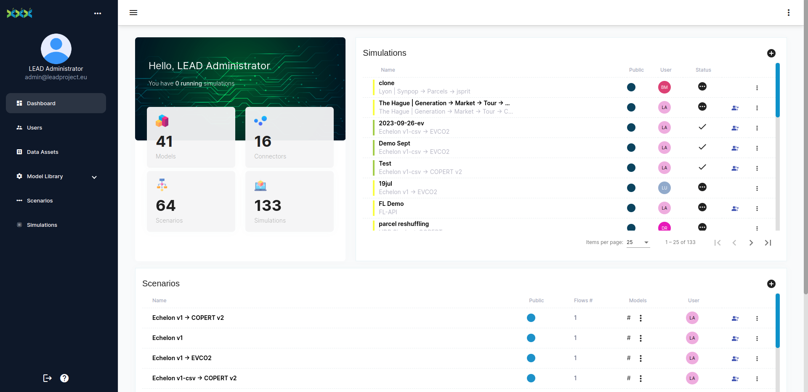
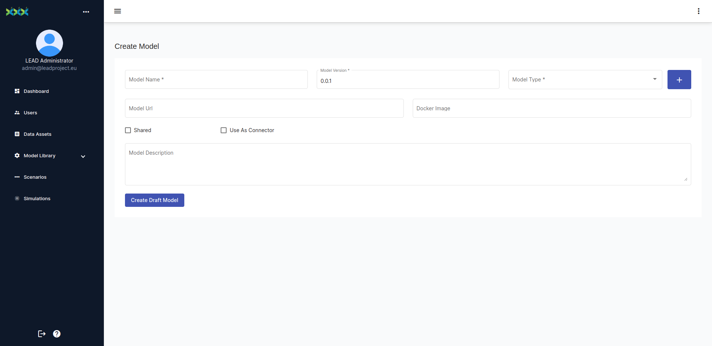
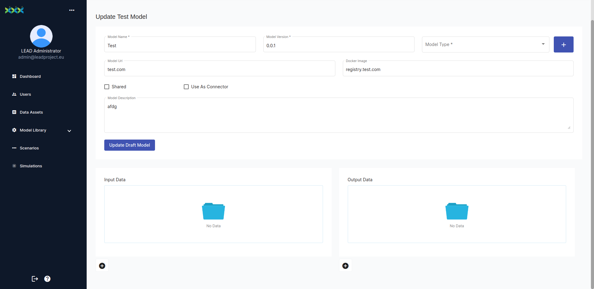
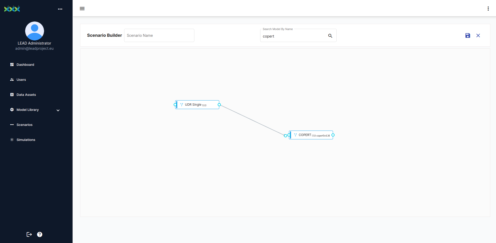
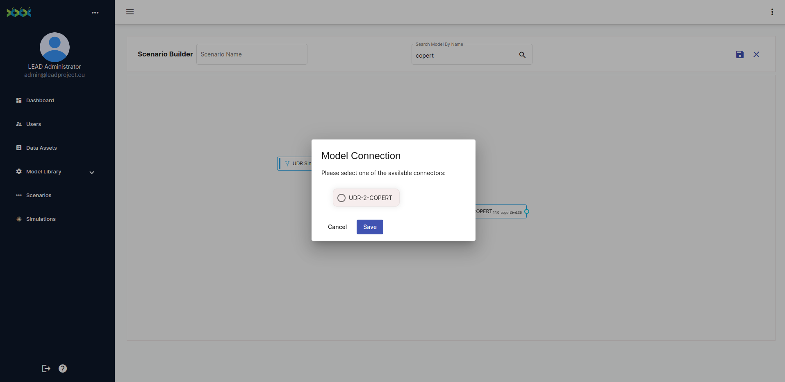

# LEAD Platform Documentation

_[Visit the platform](https://platform.leadproject.eu/) or [create an issue](https://github.com/Horizon-LEAD/lead-platform-doc/issues) requesting for access._

## Introduction

The LEAD Platform has been developed to enable the execution of models assisting the stakeholders in the decision making process and the optimization of operations and cost.

## Basic Entities

There are four main entities in the platform.

A __model__ consists of a containerised code accepting inputs and providing outputs. A __scenario__ consists of a sequence of models that are going to be run together with each model providing its output as input to the next model. Finally, a __simulation__ is an execution instance of a scenario and contains the information regarding the actual user-provided inputs for each model of the scenario that finally produce the scenario outputs.

## Registration

The registration is exclusively though an invitation system. A user can request access by creating an issue on this repository and providing an email to be used for the registration. Subsequently, the user is going to receive an email with an account activation link that will redirect him to a form where he can complete his registration. The account activation link expires after a week.

## Usage

### Model Creation

From the __Model Library__ menu the user has access to the models available in the platform.
Pressing the plus sign (+) redirects the user to the model creation interface.
There the user should provide the necessary metadata for the model execution.

Initially the user should provide metadata such as a name, a version and a description for the model.
Additionally, the model can be _tagged_ with one of the existing types or with one that the user will create.
It is also suggested that a documentation link or source code repository is provided under the Model URL field.
Finally, it is necessary to provide a link to an open container registry where the model container image is uploaded.

By checking the "Shared" checkbox the user sets the model to be available to all the platform users.

If the model is used as a connector between two other models, then the "Use As Connector" checkbox should be marked.
In the interface that will appear, the user is promped to select the two models in question.

The user can then create the draft model. At this stage, the metadata of the model are created but we have not yet defined any input or outputs for the model.
This functionality become available now.

Two new lists appear where the user must declare the input and output variables of the model.
By pressing the plus sign (+) of the input data the user is redirected to the model variable creation page.
Some generic metadata must be provided such as a name and a description.

Due to the containerized nature of the models' execution, there are two ways of passing arguments (input variables) to the model (input types).
As __environment__ (ENV) variables or as __command line input__ (CLI) arguments.
The model owner should be aware of the proper selection of this parameter.
In the case of an ENV variable the field __Variable Name__ must match exactly (case-sensitive) the environment variable used by the container.

### Scenario Builder

Using the scenario menu, the user is presented with a list of the available scenarios.
A new scenario can be created by pressing the plus sign (+).
In the scenario builder, the user can specify the scenario name and search for the model(s) that will be included in the scenario from the respective field.
The selected model can be then drag-dropped into the canvas of the scenario builder.

To connect two models that have been dropped in the canvas the user must drag from the _output dot_ of a model an connect it to the _input dot_ of the next model.

Then a prompt will display if there are any available model connector for this pair.
If so, the user can then choose one and the model connector will be automatically placed in the expected sequence in the canvas.

### Simulation Execution

A simulation can be initiated from two menus.
Either from the scenarios menu, using the menu of the row of a specific scenario of the table and selecting _Run Simulation_ or from the simulations menu by pressing the plus sign (+).
In both cases, the user is prompted to provide a name and optionally a description.
Pressing _Start Simulation_ will the redirect the user to the simulation wizard, where the user is requested to provide the necesary inputs for each model in the scenario sequence and initiate the execution.

### Data Assets

A Data Asset corresponds to some data that the user need to use in a simulation.
Usually it consists of data that are used frequently, have a more static nature, and are large enough so that the user would prefer not to constantly upload them for a simulation execution.
A Data Asset can contain multiple data files.

From the __Data Assets__ menu the user is presented with a list of all accessible assets.
To create a new asset the user can click the plus sign (+).
Then a few generic metadata are provided such as a name and a description of the assets included in this data asset.
After the assets creation the user can then use the interface to name, describe and upload the files needed.

## FAQ

- __What is the LEAD Platform ?__

    The LEAD platform is one of the key outputs of the LEAD Project, and it is a Digital Twinning platform enabling the execution and re-use of digital models for last-mile logistics without the need for developing individual case-specific digital models.

- __What are the main benefits of the LEAD Platform ?__

    The main benefit of LEAD Platform is that it enables the execution of digital models based on data assets that serve as inputs to platform-integrated digital models. End-users can create their data assets for their last-mile networks or area of responsibility and derive decision support required to optimize operations according to several Key Performance Indicators (KPIs).

- __What are the main features of the LEAD platform ?__

    The LEAD platform includes several features, such as data ingestion, digital model execution, and data/results plotting & visualization. Among other important features is the availability of already integrated models for environmental impact assessment (e.g., COPERT) and well-adopted open-source digital models, such as MATSim, OpenTripPlanner and jsprit. Depending on specific digital models, end-users and use cases, case-specific features such as real-time data ingestion, connection to operational systems through Application Programming Interfaces (APIs) with data privacy options, model integration and auto-update through a GitOps process are available.

- __Who is expected to be the main end-user of the LEAD Platform ?__

    Any stakeholder of the last-mile network, but mainly public authorities & Logistics Service Providers (LSPs). The number and types of end-users depend on the platform features and digital models available (i.e., decision support capabilities), which are all expected to grow in the following years.

- __What are the types of digital models available on the platform ?__

    The digital models included belong to the following categories:

    - Agent-Based Models (ABMs), that simulate the last-mile network performance based on individual agent’s behaviour,
    - Optimisation models, that deal with the minimisation of a cost-related function (e.g., routing models, facility location models, or other Linear Programming, Mixed Integer-Linear Programming models),
    - Network models, that handle the allocation and assignment of demand to available network resources,
    - Demand models that focus on obtaining and analysing the preferences of agents (including demand synthesis and demand prediction via AI techniques),
    - Impact assessment that analyses and measures the impact of different interventions on the last-mile network,

    In the next few months, two more categories of models will be added to the Models’ library:

    - Supply models that can be used to predict the level of service of the last-mile network based on network characteristics (e.g., fleet specification) and estimated demand,
    - Socio-cognitive agent-based models that measure how the adoption of modern policies and interventions, such as crowd shipping, affect the performance of last-mile logistics networks.

- __How to upload a data asset to the LEAD Platform ?__

    There are two ways to upload data to the LEAD Platform as an end-user. The first is as a data asset, in the case that you aim to re-use the dataset in several simulations, and the other is as a simulation-specific dataset at the Simulation Creation Wizard.

- __Can the LEAD platform estimate the environmental impact of last-mile operations ?__

    Yes, the platform already includes digital models that can estimate last-mile operations' environmental impact for conventional gasoline- or diesel-powered fleets and Electric Delivery Vehicles (EDV) fleets.

- __Can the LEAD platform estimate the economic impact of collaborative delivery and resource sharing ?__

    Currently, the LEAD platform does not include digital models that can examine these topics. However, it is one of the main development directions to include digital models that can examine Physical Internet-inspired interventions.

- __How can one person or organisation access the platform or receive related support ?__

    Any person can request access to the platform by contacting contact@inlecom.gr.

- __Are there any available demo data assets and digital models that a potential end-user can utilize to test LEAD platform features ?__

    Yes, several open data assets and digital models can be provided, after the end-user is granted access to the platform.
